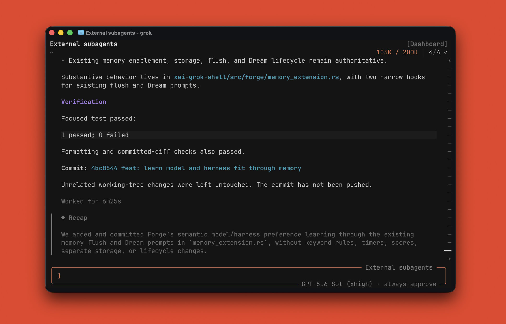

<div align="center">

<h1>Forge (<code>grok</code>)</h1>

**Forge** is an independent, upstream-friendly extension of
[Grok Build](https://github.com/xai-org/grok-build), the terminal coding agent.
It keeps the native Grok workflow while adding provider choice, a simpler
interface, and first-class orchestration across native and external coding
harnesses.

[Installing Forge](#quickstart) ·
[Features](#extended-features) ·
[Updating](#update) ·
[Architecture](#architecture) ·
[Development](#development) ·
[License](#license)



**Multi-model and multi-harness orchestration in the native Grok terminal workflow.**

Forge is not an official SpaceXAI distribution. The `main` branch is the stable,
installable Forge channel; development is integrated on `dev` and periodically
synchronized with upstream Grok Build.

</div>

---

## Extended features

| # | Feature | What Forge adds |
|---:|---|---|
| 1 | **Models and providers** | Use SpaceXAI, ChatGPT Codex, and OpenRouter in one TUI, with Codex `/fast` and provider-aware `/usage`. |
| 2 | **Multi-model, multi-harness subagents** | Delegate across native roles, Claude Code, and Codex CLI, selecting different models and harnesses for implementation, research, and independent review. |
| 3 | **Unified session browser** | Browse Forge, Claude Code, and Codex sessions together in `/sessions` through one opt-in picker, with each external session labeled by harness. |
| 4 | **Adaptive model and harness memory** | When memory is enabled, the existing memory flow learns which models, harnesses, and subagent setups work best for the user across different task types, using explicit feedback and clear interaction outcomes. |
| 5 | **Simpler Forge theme** | A cleaner, less distracting interface with compact controls and model information. |

## Quickstart

### Prerequisites

The default installer requires `curl`, `tar`, and either `shasum` or
`sha256sum`. It downloads a checksummed prebuilt binary, so ordinary users do
not need Rust, Cargo, Git, `dotslash`, or `protoc`.

Building Forge from source requires Git, [Rust](https://rustup.rs/) and `cargo`,
plus either [`dotslash`](https://dotslash-cli.com/) or `protoc` on `PATH`. The
installer checks prerequisites and does not install system packages or alter
shell configuration.

### Install from GitHub

```sh
curl -fsSL https://raw.githubusercontent.com/DeveshParagiri/forge/main/scripts/install | sh
```

The installer detects the operating system and architecture, downloads the
matching artifact from the latest GitHub Release, verifies its SHA-256 checksum,
and atomically installs it at `~/.grok/bin/grok`. On macOS, it ad-hoc signs the
installed binary when `codesign` is available. Compatibility links are created
for common previous install locations.

Configuration, authentication, and sessions under `~/.grok/` are preserved.
Normal installations do not create or maintain a source checkout.

### Install from source

Contributors can explicitly clone and compile the `dev` branch under
`~/Projects/forge`:

```sh
FORGE_INSTALL_MODE=source \
  curl -fsSL https://raw.githubusercontent.com/DeveshParagiri/forge/main/scripts/install | sh
```

### Verify

Ensure `~/.grok/bin` is on `PATH`, then run:

```sh
grok --version
grok
```

## Optional external harnesses

External subagents require their corresponding official CLI to be installed and
authenticated separately:

```sh
claude --version
codex --version
```

Forge discovers available harnesses at runtime. You can use Forge normally when
neither is installed, and installing only one enables only that adapter. Follow
the official [Claude Code](https://docs.anthropic.com/en/docs/claude-code) and
[Codex CLI](https://github.com/openai/codex) instructions for installation and
subscription authentication.

External harness sessions are hidden from `/sessions` by default. Enable them
in `~/.grok/config.toml`:

```toml
[sessions]
show_external = true
```

Claude Code and Codex rows are labeled by harness. Selecting one starts a fresh
Forge session and invokes its existing `/resume-claude` or `/resume-codex`
context-import flow.

## Update

For installations created by the GitHub installer, run:

```sh
grok update
```

A plain `grok update` delegates to the same release installer used by the
quickstart. The historical direct command remains as a recovery or automation
alias, but follows the identical binary path:

```sh
~/bin/grok-update-from-source
```

Both commands download and verify the latest published artifact before replacing
the binary atomically; they do not fetch, rebase, or compile a source checkout.
Re-running the GitHub install command is also safe. Authentication,
configuration, and session data remain untouched during every update path.

## Releases and versioning

`main` is the rolling stable install channel, while Git commit hashes identify
an exact source revision. Forge releases use independent semantic versioning
such as `forge-v0.1.0` and `forge-v0.1.1`; the synchronized upstream Grok version
is recorded separately in release notes and build metadata. See
[`CHANGELOG.md`](CHANGELOG.md) for Forge's release history.

To install a published version instead of the latest release:

```sh
FORGE_VERSION=0.1.0 \
  curl -fsSL https://raw.githubusercontent.com/DeveshParagiri/forge/main/scripts/install | sh
```

Use an existing published version in place of the example. The initial
`forge-v0.2.105.1` pipeline tag is retained for release provenance, but new tags
follow Forge SemVer.

## Architecture

Fork-specific behavior is isolated in additive, per-crate `forge/` modules.
Provider policy, external-harness adapters, prompt extensions, UI behavior, and
compatibility logic live beside their owning crates rather than being spread
through upstream implementation files. Upstream-owned code contains only narrow,
generic hooks where Forge must enter an existing lifecycle or render path.

External harness support is provider-neutral at the orchestration boundary, with
separate Claude Code and Codex CLI adapters. Model features such as Codex fast
mode are capability-driven rather than selected through model-name matching.
These boundaries keep new providers and harnesses extensible and reduce the
surface likely to conflict when upstream Grok Build changes.

See [`FORK-MAINTENANCE.md`](FORK-MAINTENANCE.md) for module ownership,
integration points, compatibility policy, focused verification commands,
branch conventions, and upstream rebase guidance.

## Maintainer workflow

Forge uses three principal refs:

| Ref | Purpose |
|---|---|
| `upstream/main` | Official source from `xai-org/grok-build` |
| `dev` | Forge integration and upstream synchronization |
| `main` | Validated, published, installable Forge |

Synchronize a clean `dev` branch with upstream:

```sh
scripts/forge-sync-upstream
```

The script fetches `upstream/main` and rebases `dev` locally. After resolving any
conflicts and validating the result, publish the exact integration commit:

```sh
scripts/forge-publish main
```

The publisher runs focused formatting, compilation, and Forge tests by default.
It refuses dirty trees, the wrong source branch, and non-fast-forward publication;
it never rewrites published history. End-user updates never rebase against
upstream—the explicit synchronization workflow is only for maintainers.

## Build manually

```sh
git clone https://github.com/DeveshParagiri/forge.git
cd forge
cargo build -p xai-grok-pager-bin --release
mkdir -p ~/.grok/bin
install -m 755 target/release/xai-grok-pager ~/.grok/bin/grok
```

On macOS, sign a manually installed build with:

```sh
codesign --force --sign - ~/.grok/bin/grok
codesign --verify ~/.grok/bin/grok
```

## Development

Target individual crates because full-workspace builds and test suites are slow:

```sh
cargo fmt --all
cargo check -p <crate>
cargo test -p <crate>
cargo clippy -p <crate>
```

See [`CONTRIBUTING.md`](CONTRIBUTING.md) for the contribution policy and
[`FORK-MAINTENANCE.md`](FORK-MAINTENANCE.md) for focused Forge checks.

## License

First-party source is licensed under the [Apache License 2.0](LICENSE).
Third-party and vendored source remains under its original licenses; see
[`THIRD-PARTY-NOTICES`](THIRD-PARTY-NOTICES) and
[`third_party/NOTICE`](third_party/NOTICE).
