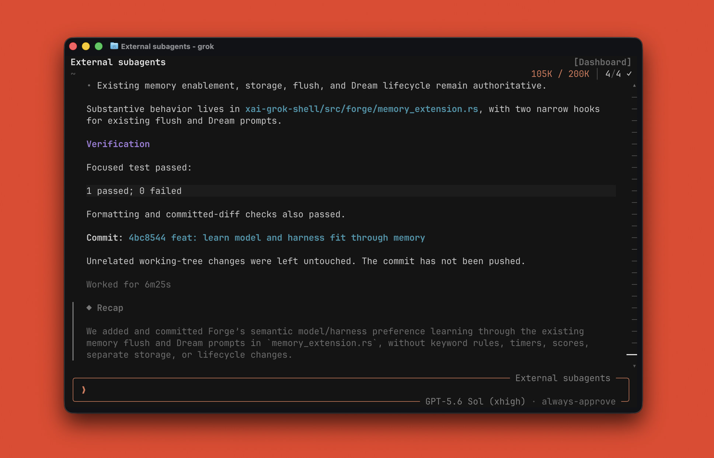

<div align="center">

<h1>Forge (<code>grok</code>)</h1>

**Forge** is an independent, upstream-friendly extension of
[Grok Build](https://github.com/xai-org/grok-build), the terminal coding agent.
It keeps the native Grok workflow while adding provider choice, a focused
interface, and first-class orchestration across native and external coding
harnesses.

[Install](#install-forge) ·
[Configure](#authentication-and-models) ·
[Features](#extended-features) ·
[Build](#requirements-and-source-builds) ·
[Architecture](#extension-architecture) ·
[Develop](#maintainer-workflow)



**Multi-model and multi-harness orchestration in the native Grok terminal workflow.**

Forge is not an official SpaceXAI distribution. The `main` branch is the stable,
installable Forge channel; development is integrated on `dev` and periodically
synchronized with upstream Grok Build.

</div>

---

## Current release

The latest published release is **Forge 0.3.2**, synchronized with **Grok Build
0.2.121**. The `dev` branch is synchronized with **Grok Build 1.0.0** for the
next Forge release. Forge versions are independent of upstream versions:
release tags use `forge-vMAJOR.MINOR.PATCH`, while synchronized development and
release bases are recorded in [`CHANGELOG.md`](CHANGELOG.md) and release notes.

## Install Forge

Install the latest checksummed release:

```sh
curl -fsSL https://raw.githubusercontent.com/DeveshParagiri/forge/main/scripts/install | sh
```

The installer selects the archive for macOS Apple Silicon, Linux x86-64, or
Linux ARM64; verifies its SHA-256 checksum; and installs the canonical executable
at `~/.grok/bin/grok`. It also refreshes compatibility links without changing
your shell configuration.

Launch Forge:

```sh
grok
```

Update to the latest Forge release at any time:

```sh
grok update
```

Configuration, authentication, sessions, and memory remain under `~/.grok/`.
For installs made with the release command above, the installed updater downloads
another packaged release; it does not rebase a source checkout or require Rust.
Source-mode installations use their configured checkout and toolchain instead
(see [Requirements and source builds](#requirements-and-source-builds)).

### Install a specific release

Pass a Forge version with or without the `forge-v` prefix:

```sh
FORGE_VERSION=0.3.2 \
  curl -fsSL https://raw.githubusercontent.com/DeveshParagiri/forge/main/scripts/install | sh
```

## Extended features

| Feature | What Forge adds |
|---|---|
| **Models and providers** | Use SpaceXAI, ChatGPT Codex, and upstream-compatible third-party providers in one model picker. Provider capabilities, credentials, and request policy remain isolated. |
| **Fast Mode and usage** | Toggle session-scoped Codex Fast Mode with `/fast` on models that advertise support. `/usage` follows the active provider's supported accounting path. |
| **Multi-model subagents** | Delegate independent implementation, research, planning, and verification work to native roles with explicit model and reasoning-effort choices. |
| **External harnesses** | Run Claude Code and Codex CLI as subagent harnesses through their own installations, authentication, model defaults, and tools. |
| **Unified sessions** | Optionally browse Forge, Claude Code, and Codex sessions together in `/sessions`; importing an external row creates a new Forge session. |
| **Adaptive memory** | When memory is enabled, the existing memory flow can retain durable model and harness preferences from explicit feedback and clear outcomes. Current instructions always win. |
| **Forge interface** | A compact Forge theme, capability-aware model labels, and consistent `Shift+Tab` reasoning-effort cycling in the agent prompt. |

## Authentication and models

The exact model roster depends on the providers configured and authenticated for
the current installation. Forge uses the stock SpaceXAI login flow, the Codex
CLI's OAuth file for ChatGPT subscription models, and upstream Grok Build's
generic model-provider configuration for other endpoints.

### SpaceXAI

Start Forge and use `/login`, or run:

```sh
grok login
```

This remains the stock first-party authentication path.

### ChatGPT Codex

Install and authenticate the official Codex CLI separately:

```sh
codex login
```

Forge can read the resulting `~/.codex/auth.json` only for an explicitly
configured Codex provider at the canonical ChatGPT Codex HTTPS endpoint. A
minimal provider block looks like this:

```toml
# ~/.grok/config.toml
[model_providers.codex]
base_url = "https://chatgpt.com/backend-api/codex"
api_backend = "responses"
env_key = "CODEX_ACCESS_TOKEN"

[model_providers.codex.extra_headers]
OpenAI-Beta = "responses=experimental"
originator = "codex_cli_rs"

[model."gpt-5.6-sol"]
model_provider = "codex"
model = "gpt-5.6-sol"
name = "GPT-5.6 Sol"
context_window = 200000
supports_reasoning_effort = true
supports_fast_mode = true
```

Select the model from the picker or set it as the default:

```toml
[models]
default = "gpt-5.6-sol"
default_reasoning_effort = "high"
```

`/fast` is session-scoped and sends priority service-tier metadata only when the
active model declares `supports_fast_mode = true`. `/usage` uses the ChatGPT
account usage endpoint for this provider. Missing or expired Codex credentials
are repaired with `codex login`, not Forge's `/login` flow.

### Other OpenAI-compatible providers

Forge retains upstream `[model_providers.*]` and `[model.*]` configuration. For
example:

```toml
# ~/.grok/config.toml
[model_providers.example]
base_url = "https://api.example.com/v1"
api_backend = "chat_completions"
env_key = "EXAMPLE_API_KEY"

[model.example-model]
model_provider = "example"
model = "provider/model-id"
name = "Example Model"
context_window = 200000
```

Prefer `env_key` over writing a static `api_key` to disk. Forge does not maintain
a separate third-party key store or provider-login UI. Generic endpoint,
credential, header, and model inheritance behavior comes from upstream Grok
Build. Forge enables xAI session credentials only for trusted xAI HTTPS
endpoints and strips xAI-private headers at the final request boundary for
unknown, cleartext, custom-proxy, and third-party endpoints.

For the complete schema, including query parameters, environment-backed headers,
and model overrides, see the
[custom-model guide](crates/codegen/xai-grok-pager/docs/user-guide/11-custom-models.md).

## External harnesses and sessions

External subagents require the corresponding official CLI to be installed and
authenticated separately:

```sh
claude --version
codex --version
```

Forge discovers available harnesses at runtime. Neither CLI is required for
normal Forge use, and installing only one enables only that adapter. External
harnesses use provider-native tools rather than Forge-hosted tools; omitting an
explicit model uses the harness's native default.

External sessions are hidden from `/sessions` by default. Enable local discovery
in `~/.grok/config.toml`:

```toml
[sessions]
show_external = true
```

Rows are labeled `Claude Code` or `Codex`. Selecting one creates a fresh Forge
session and invokes the existing `/resume-claude` or `/resume-codex` context
import; it does not reopen the external harness UI or treat a foreign session ID
as a native Forge session.

## Privacy and credential boundaries

- Forge configuration, sessions, and memory are stored under `~/.grok/`.
- Codex OAuth data remains owned by the Codex CLI in `~/.codex/auth.json`.
- External session stores are read only when external-session discovery is
  enabled, and imports create a new Forge session.
- Forge does not create an OpenRouter- or third-party-specific credential store.
  Environment-backed API keys are preferred for generic providers.
- Requests and prompts go to the provider selected for that session. Provider
  switches remove opaque provider reasoning and flatten nonportable backend tool
  history before the next request.
- xAI session credentials are resolved only for trusted xAI HTTPS endpoints;
  xAI-private headers are also stripped from untrusted requests at the final
  sampler boundary.
- Forge's adaptive preference behavior uses the existing memory lifecycle; it
  adds no separate analytics service or credential-bearing record format.

The shared Grok telemetry controls and data categories are documented in the
[monitoring and usage guide](crates/codegen/xai-grok-pager/docs/user-guide/24-monitoring-usage.md).

## Requirements and source builds

The release installer requires `curl`, `tar`, and either `shasum` or
`sha256sum`. Ordinary users do not need Rust, Cargo, Git, DotSlash, or `protoc`.

Building from source requires Git, [Rust](https://rustup.rs/), Cargo, and either
[`dotslash`](https://dotslash-cli.com/) or `protoc` on `PATH`. The repository's
[`rust-toolchain.toml`](rust-toolchain.toml) pins Rust **1.94.0**.

Clone the stable branch and build manually:

```sh
git clone --branch main https://github.com/DeveshParagiri/forge.git
cd forge
cargo build --locked -p xai-grok-pager-bin --release
mkdir -p ~/.grok/bin
install -m 755 target/release/xai-grok-pager ~/.grok/bin/grok
```

On macOS, ad-hoc sign a manually installed binary:

```sh
codesign --force --sign - ~/.grok/bin/grok
codesign --verify ~/.grok/bin/grok
```

The installer also supports a source mode. It checks prerequisites but does not
install system packages or alter shell configuration:

```sh
FORGE_INSTALL_MODE=source GROK_BRANCH=main \
  curl -fsSL https://raw.githubusercontent.com/DeveshParagiri/forge/main/scripts/install | sh
```

## Extension architecture

Fork-specific behavior belongs in additive, crate-local `forge/` modules.
Upstream-owned code contains narrow hooks only where Forge must enter an existing
request, session, lifecycle, prompt, or rendering path.

| Extension | Where it belongs | Integration rule |
|---|---|---|
| Provider/model capability | Shell or sampler `forge/` modules plus upstream `[model_providers.*]` metadata | Declare capabilities explicitly; do not infer security or behavior from model-name substrings. |
| Codex request behavior | Sampler endpoint policy and Responses adapter | Positively identify the canonical HTTPS endpoint and strip xAI-private metadata from every untrusted request shape. |
| Session importer | Pager/session `forge/` policy over existing discovery and normalization | Keep foreign IDs out of native ACP loading; import context into a fresh Forge session. |
| External harness | A harness-specific adapter behind provider-neutral lifecycle handling | Keep CLI flags, authentication, session IDs, and output parsing inside the adapter. |
| Prompt or shortcut behavior | Action/command registry with a narrow dispatch/render hook | Generate visible hints from the same action state so documentation and runtime behavior do not drift. |
| Theme and product UI | Pager-render and pager `forge/` modules | Keep palette and branding policy additive; preserve upstream layout contracts. |

When adding a provider, use upstream generic provider configuration first and add
Forge code only for genuinely provider-specific capability or safety behavior.
When adding a harness, implement availability, launch/resume, structured event
handling, cancellation, and cleanup behind the shared adapter boundary. New
session sources should reuse normalized session metadata and explicit import
handoffs rather than branching throughout the picker.

See [`FORK-MAINTENANCE.md`](FORK-MAINTENANCE.md) for current module ownership,
integration points, security invariants, focused tests, branch conventions, and
upstream synchronization guidance. See the
[Forge additions guide](crates/codegen/xai-grok-pager/docs/user-guide/25-forge-additions.md)
for detailed user-facing behavior.

## Maintainer workflow

Forge uses three principal refs:

| Ref | Purpose |
|---|---|
| `upstream/main` | Official source from `xai-org/grok-build` |
| `dev` | Forge integration and upstream synchronization |
| `main` | Validated, published, installable Forge |

Synchronize a clean local `dev` branch:

```sh
scripts/forge-sync-upstream
```

That helper fetches `upstream/main` and rebases local `dev`; it does not publish.
The scheduled GitHub workflow instead prepares or refreshes a reviewable
`bot/upstream-sync` pull request into `dev` and never auto-merges it.

After resolving conflicts and running the focused checks, publish the exact
validated integration commit without rewriting history:

```sh
scripts/forge-publish main
```

The publisher runs formatting, compilation, and focused Forge tests by default.
It refuses dirty trees, the wrong source branch, and non-fast-forward updates.
Create immutable Forge release tags only after `dev` and `main` point to the same
validated commit.

## Development

Target individual crates because full-workspace builds and test suites are slow:

```sh
cargo fmt --all -- --check
git diff --check
cargo check -p <crate>
cargo test -p <crate> <relevant-test-filter>
cargo clippy -p <crate>
```

See [`CONTRIBUTING.md`](CONTRIBUTING.md) for contribution policy and
[`FORK-MAINTENANCE.md`](FORK-MAINTENANCE.md) for the focused Forge verification
matrix.

## License

First-party source is licensed under the [Apache License 2.0](LICENSE).
Third-party and vendored source remains under its original licenses; see
[`THIRD-PARTY-NOTICES`](THIRD-PARTY-NOTICES) and
[`third_party/NOTICE`](third_party/NOTICE).
